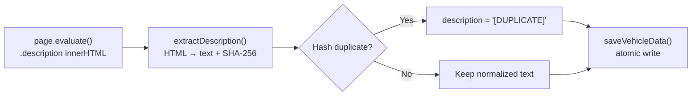

# Walkthrough: Vehicle Description Extraction

## Tổng quan

Đã thêm tính năng trích xuất mô tả xe (description) từ HTML `.description` div, chuyển đổi sang plain text sạch, lưu trữ với atomic write và hash-based deduplication.

## Các file đã thay đổi

| File | Thay đổi |
|------|----------|
| [description-extractor.ts](file:///d:/Workspace/user-cars-repository/repo-design/crawl_dataset/src/utils/description-extractor.ts) | **[NEW]** Module normalize HTML → plain text + SHA-256 hash |
| [types.ts](file:///d:/Workspace/user-cars-repository/repo-design/crawl_dataset/src/types/types.ts) | Thêm `description` vào [VehicleInfo](file:///d:/Workspace/user-cars-repository/repo-design/crawl_dataset/src/types/types.ts#30-42), `description_hash` vào [VehicleData](file:///d:/Workspace/user-cars-repository/repo-design/crawl_dataset/src/types/types.ts#49-60) |
| [vehicle-detail-crawler.ts](file:///d:/Workspace/user-cars-repository/repo-design/crawl_dataset/src/services/vehicle-detail-crawler.ts) | Extract `.description` innerHTML → normalize ngoài browser context |
| [storage-manager.ts](file:///d:/Workspace/user-cars-repository/repo-design/crawl_dataset/src/services/storage-manager.ts) | Lazy-load hash Set + [isDescriptionDuplicate()](file:///d:/Workspace/user-cars-repository/repo-design/crawl_dataset/src/services/storage-manager.ts#59-68) + track hash on save |
| [worker.ts](file:///d:/Workspace/user-cars-repository/repo-design/crawl_dataset/src/workers/worker.ts) | Check dedup → mark `[DUPLICATE]` nếu trùng, truyền `description_hash` |
| [test-description-extractor.ts](file:///d:/Workspace/user-cars-repository/repo-design/crawl_dataset/src/scripts/test-description-extractor.ts) | **[NEW]** 17 test cases |

## Pipeline xử lý



## Output format mẫu

```json
{
  "vehicle_info": {
    "description": "Xe đẹp, máy ngon, gầm bệ chắc chắn.\n\nNội thất zin, sạch sẽ.\n\nLiên hệ :0912 345 678"
  },
  "description_hash": "a1b2c3d4e5..."
}
```

## Verification

- **TypeScript compilation**: ✅ 0 errors
- **Test suite**: ✅ 17/17 passed
  - HTML cơ bản với `<br>`, `<span>`
  - Attributes stripped (onclick, class, data-track)
  - Phone numbers preserved
  - Hash deduplication (same/different content)
  - Empty/whitespace input
  - Script/style removal
  - Blank line collapsing
  - HTML entity decoding
